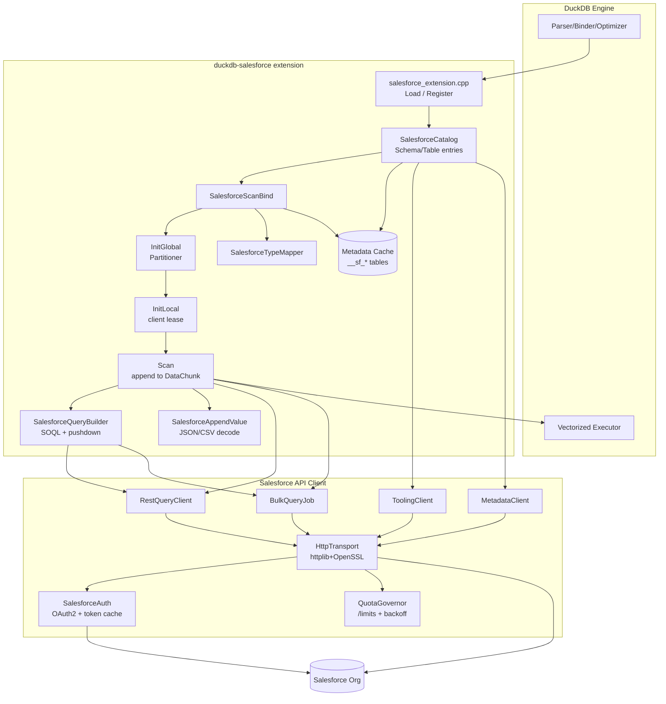
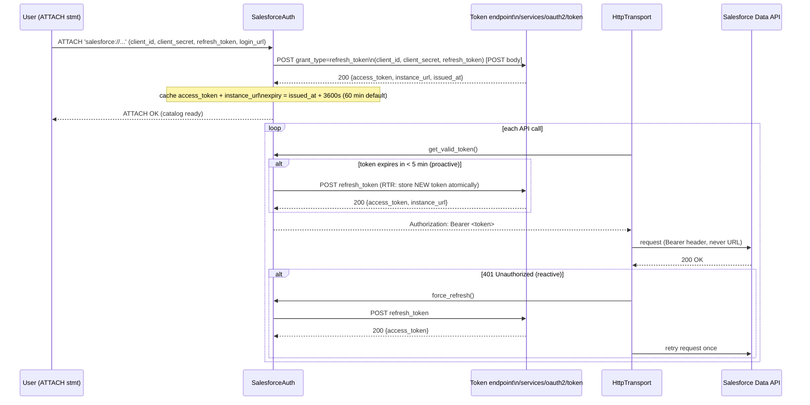
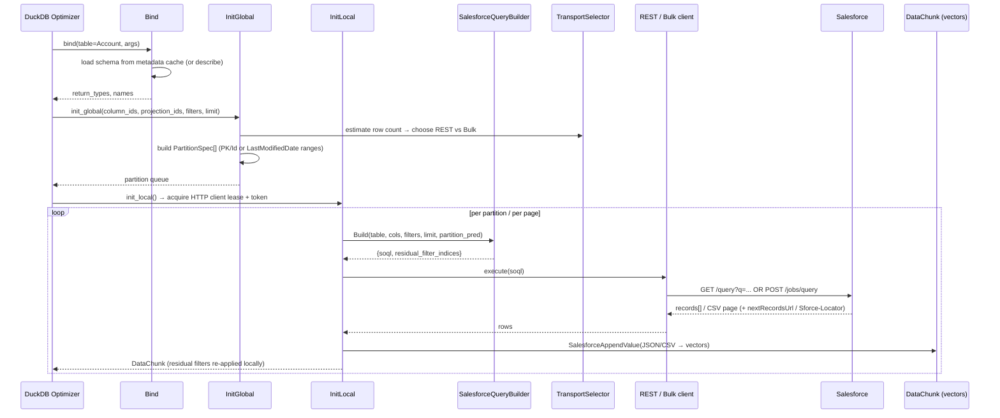

# duckdb-salesforce — Architecture

> Architecture document for a DuckDB out-of-tree (community) extension that exposes Salesforce orgs as queryable, scannable tables inside DuckDB. The design directly reuses the proven architecture of `duckdb-firebird` (catalog/storage extension + parallel table-function scanner + pushdown query builder + connection pool) and replaces the Firebird ISC wire protocol with Salesforce's official HTTP APIs (REST/SOQL, Bulk API 2.0, Tooling API, Metadata API, optionally GraphQL/UI API), authenticated via OAuth 2.0.
>
> Every limit, quota, and threshold cited below is taken verbatim from the Salesforce API research bundled with this design. No numbers are invented.

---

## Table of Contents

1. [Complete Architecture Overview](#1-complete-architecture-overview)
2. [Diagrams](#2-diagrams)
3. [Components](#3-components)
4. [Authentication Flow](#4-authentication-flow)
5. [Query Flow](#5-query-flow)
6. [REST API Strategy](#6-rest-api-strategy)
7. [Bulk API 2.0 Strategy](#7-bulk-api-20-strategy)
8. [Metadata API Strategy](#8-metadata-api-strategy)
9. [Tooling API Strategy](#9-tooling-api-strategy)
10. [Cache Strategy](#10-cache-strategy)
11. [Pushdown Strategy](#11-pushdown-strategy)
12. [Class Structure](#12-class-structure)
13. [C++ File Structure](#13-c-file-structure)
14. [DuckDB Extension Structure](#14-duckdb-extension-structure)
15. [Roadmap v0.1 → v1.0](#15-roadmap-v01--v10)
16. [Risk Analysis](#16-risk-analysis)
17. [Salesforce Quota Analysis](#17-salesforce-quota-analysis)
18. [Test Plan](#18-test-plan)
19. [Expected Benchmarks](#19-expected-benchmarks)
20. [What Can Be Reused Directly from duckdb-firebird](#20-what-can-be-reused-directly-from-duckdb-firebird)
21. [What Must Be Rewritten](#21-what-must-be-rewritten)
22. [What Should Be Abstracted Into a Generic SaaS-Connector Layer](#22-what-should-be-abstracted-into-a-generic-saas-connector-layer)
- [Appendix A: API-Selection Decision Logic (REST vs Bulk 2.0 vs GraphQL)](#appendix-a-api-selection-decision-logic)
- [Appendix B: Future "Vault Mode" (Salesforce → Parquet → Offline DuckDB)](#appendix-b-future-vault-mode)

---

## 1. Complete Architecture Overview

`duckdb-salesforce` is a **storage/catalog extension** with a **parallel table-function scanner**, structurally identical to `duckdb-firebird`. The fundamental substitution is at the transport layer: where Firebird used the ISC C API over a TCP wire protocol (`isc_attach_database`, `isc_dsql_*`, XSQLDA buffers), Salesforce is reached over HTTPS using JSON/CSV payloads and OAuth 2.0 bearer tokens. Every other layer — catalog mapping, bind/init/scan lifecycle, projection/filter/limit pushdown, partitioning heuristic, vectorized append into DuckDB chunks — survives the port with structural reuse.

### Layered model

```
┌──────────────────────────────────────────────────────────────────────────┐
│ Layer 0 — DuckDB Engine (host process)                                     │
│   SQL parser, binder, optimizer, vectorized executor, parallel pipeline.   │
│   Issues: ATTACH ... (TYPE salesforce); SELECT ... FROM sf.Account WHERE…  │
└───────────────────────────────┬────────────────────────────────────────────┘
                                 │  StorageExtension / TableFunction ABI
┌───────────────────────────────▼────────────────────────────────────────────┐
│ Layer 1 — duckdb-salesforce Extension (this project)                        │
│   1a. Catalog/Storage  : SalesforceCatalog / Schema / Table entries         │
│   1b. Scanner          : Bind → InitGlobal (partition) → InitLocal → Scan   │
│   1c. Query Builder    : SOQL generation, pushdown, residual-filter marking │
│   1d. Type Mapper      : Salesforce field type → DuckDB LogicalType         │
│   1e. Append/Decode    : JSON / CSV cell → DuckDB Vector                    │
│   1f. Metadata Cache   : __sf_objects / __sf_fields / __sf_relationships …  │
└───────────────────────────────┬────────────────────────────────────────────┘
                                 │  in-process function calls
┌───────────────────────────────▼────────────────────────────────────────────┐
│ Layer 2 — Salesforce API Client (HTTP abstraction)                          │
│   2a. Auth Manager     : OAuth2 refresh-token flow, token cache, 401 retry  │
│   2b. HTTP Transport   : httplib + OpenSSL, retry/backoff, 429/403 handling │
│   2c. API Routers      : RestQueryClient / BulkQueryJob / Tooling / Metadata│
│   2d. Quota Governor   : /limits polling, daily-budget guard, rate limiter  │
└───────────────────────────────┬────────────────────────────────────────────┘
                                 │  HTTPS (TLS) — JSON + CSV
┌───────────────────────────────▼────────────────────────────────────────────┐
│ Layer 3 — Salesforce Org (multi-tenant SaaS)                                │
│   /services/oauth2/token                                                    │
│   /services/data/vXX.0/query · /queryAll · /query/{locator}                 │
│   /services/data/vXX.0/jobs/query (Bulk API 2.0)                            │
│   /services/data/vXX.0/tooling/query (EntityDefinition/FieldDefinition)     │
│   /services/data/vXX.0/sobjects/{X}/describe                                │
│   /services/data/vXX.0/limits                                               │
└──────────────────────────────────────────────────────────────────────────┘
```

### Core mapping (Firebird → Salesforce)

| Firebird concept | Salesforce equivalent |
|---|---|
| `isc_attach_database(db.fdb)` | OAuth2 token exchange + `instance_url` discovery |
| `RDB$RELATIONS` (table list) | `EntityDefinition` (Tooling) / Global Describe (REST) |
| `RDB$RELATION_FIELDS ⋈ RDB$FIELDS` | `FieldDefinition` (Tooling) / sObject Describe (REST) |
| Single-column numeric PK + `MIN/MAX` | `Id` field / PK Chunking / `LastModifiedDate` ranges |
| Firebird SQL `SELECT … ROWS m TO n` | SOQL `SELECT … LIMIT n` (+ Bulk locator paging) |
| XSQLDA fetch loop | JSON `records[]` page / CSV streaming rows |
| Read-only transaction | Point-in-time query snapshot (no explicit txn) |
| `CHARACTER SET NONE` transcoding | N/A — Salesforce JSON/HTTP is always UTF-8 |

The decisive architectural difference from Firebird is that Salesforce offers **multiple transport APIs with hard, published quotas**, so the extension must contain a **transport-selection policy** (Appendix A) and a **quota governor** (§17) — concepts that have no Firebird analog and are net-new.

---

## 2. Diagrams

### 2.1 Component diagram



### 2.2 Authentication flow



### 2.3 Query flow



---

## 3. Components

Each component below maps 1:1 to a `duckdb-firebird` counterpart (cited) unless marked **NEW**.

| Component | File (target) | Firebird ancestor | Responsibility |
|---|---|---|---|
| **Extension entry** | `salesforce_extension.cpp` | `firebird_extension.cpp:17-39` | `Load()`, register `StorageExtension` for type `salesforce`, register table functions, register `DBConfig` extension options (default API version, page size, transport thresholds, quota reserve %). |
| **Catalog/Storage** | `salesforce_storage.cpp` | `firebird_storage.cpp:1-100` | Map `ATTACH` → `SalesforceCatalog`/`SalesforceSchemaEntry`/`SalesforceTableEntry`. Lazy-load sObject list. `SalesforceTransactionManager` is a no-op read-only manager (Salesforce queries are point-in-time snapshots). |
| **Bind data** | `salesforce_scanner.hpp/.cpp` | `firebird_scanner.hpp:22-88`, `firebird_scanner.cpp:346-486` | `SalesforceBindData`: connection info, column names/types/descs, `PrimaryKeyInfo` (the `Id`/`LastModifiedDate` partition key), partition config, extra predicates, chosen transport hint. |
| **Global state / Partitioner** | `salesforce_scanner.cpp` | `firebird_scanner.cpp:529-573` | `SalesforceGlobalState`: compute partition count (`PickPartitionCount`), slice key range into `PartitionSpec[]` (`where_clause` → SOQL `WHERE`), capture `column_ids`/`projection_ids`/`filters`. **NEW**: select transport (REST/Bulk) by estimated row count. |
| **Local state** | `salesforce_scanner.cpp` | `firebird_scanner.cpp:575-595` | `SalesforceLocalState`: acquire HTTP client lease from pool (or fresh client), own page cursor / Bulk locator, scratch `fetch_chunk` for projection mapping. |
| **Scan execution** | `salesforce_scanner.cpp` | `firebird_scanner.cpp:607-650` | Open next partition; build SOQL; execute via chosen client; paginate (`nextRecordsUrl` / `Sforce-Locator`); decode into vectors; re-apply residual filters. |
| **Query builder** | `salesforce_query.cpp/.hpp` | `firebird_query.*` | `SalesforceQueryBuilder::Build` → `{soql, residual_filter_indices, residual_filter_reasons, pushed_filter_sql}`. SOQL dialect, operator translation, literal formatting (Salesforce uses literal-interpolated values, **not** bound params). |
| **Type mapper** | `salesforce_types.cpp/.hpp` | `firebird_types.*` | `SalesforceFieldTypeToDuckDBType`: Salesforce field `DataType` → DuckDB `LogicalType`. No charset transcoding (always UTF-8). |
| **Append/decode** | `salesforce_types.cpp` | `FirebirdAppendValue` | `SalesforceAppendValue`: extract one cell from JSON record / CSV column, parse ISO-8601 timestamps, null handling, materialize into `Vector`. |
| **Auth manager** **NEW** | `salesforce_auth.cpp/.hpp` | — (replaces ISC auth) | OAuth2 refresh-token flow, token + `instance_url` cache, proactive/reactive refresh, RTR atomic token update. |
| **HTTP transport** **NEW** | `salesforce_http.cpp/.hpp` | replaces `firebird_client_loader.cpp` dlopen | `httplib`+OpenSSL wrapper; injects Bearer header; retry with exponential backoff + jitter; classifies 429 vs 403. |
| **Connection/session pool** | `salesforce_client.cpp/.hpp` | `FirebirdConnectionPool` (`firebird_client.hpp:45-287`) | LIFO idle queue of HTTP sessions + shared token; lease acquire/release; lifetime counters. |
| **REST query client** **NEW** | `salesforce_rest.cpp/.hpp` | replaces `FirebirdStatement` (small path) | `/query` + `queryMore` via `nextRecordsUrl`; up to 2,000 records/page. |
| **Bulk query job** **NEW** | `salesforce_bulk.cpp/.hpp` | replaces `FirebirdStatement` (large path) | Bulk API 2.0 job lifecycle, polling, CSV result paging via `Sforce-Locator`, PK chunking. |
| **Tooling client** **NEW** | `salesforce_tooling.cpp/.hpp` | replaces `RDB$` probes | `EntityDefinition`/`FieldDefinition`/`RelationshipInfo` SOQL for fast schema discovery. |
| **Metadata client** **NEW** | `salesforce_metadata.cpp/.hpp` | replaces `RDB$` probes (deep) | SOAP Metadata API for picklists/record types/relationships not exposed by Tooling. |
| **Quota governor** **NEW** | `salesforce_quota.cpp/.hpp` | — | `/limits` polling, daily-budget tracking, rate limiter (~15 calls/s), backoff coordination. |
| **Metadata cache** **NEW** | `salesforce_cache.cpp/.hpp` | extends Firebird lazy catalog load | In-memory + optional persisted `__sf_objects`/`__sf_fields`/`__sf_relationships`/`__sf_picklists`/`__sf_recordtypes`; TTL/invalidation. |
| **Observability/profile** | `salesforce_observability.cpp` | `firebird` observability + profile_table | Surface pushed vs residual filters, transport used, API calls consumed, quota remaining. |
| **dbt sources** | `salesforce_dbt_sources.cpp` | `firebird` dbt_sources | Emit dbt source YAML from cached sObject catalog. |

---

## 4. Authentication Flow

Salesforce authentication is **OAuth 2.0** and replaces Firebird's `user/password` + ISC attach entirely.

### 4.1 ATTACH credential intake

```sql
ATTACH 'salesforce://my-org' AS sf (
    TYPE            salesforce,
    client_id       '<consumer key>',
    client_secret   '<consumer secret>',
    refresh_token   '<refresh token>',
    login_url       'https://login.salesforce.com',  -- or test.salesforce.com / My Domain
    api_version     '60.0'
);
```

`SalesforceConnectionInfo::ParseOAuth` (replacing `FirebirdConnectionInfo::Parse`) extracts these into the connection info struct. The struct stores **OAuth token state + instance URL** instead of a database file path.

### 4.2 Token exchange (refresh-token flow)

On ATTACH, `SalesforceAuth` performs:

```
POST {login_url}/services/oauth2/token
Content-Type: application/x-www-form-urlencoded
Body: grant_type=refresh_token
      &client_id=<id>
      &client_secret=<secret>
      &refresh_token=<token>
```

Response yields `access_token` and **`instance_url`** (dynamically resolved, e.g. `https://na1.salesforce.com`, `https://eu5.salesforce.com`, or a custom My Domain). Per the research, **`instance_url` must never be hardcoded** — sandbox and custom domains differ, and hardcoding `login.salesforce.com` breaks them. All subsequent data-API calls target `instance_url`.

### 4.3 Token lifecycle

- **Access-token lifetime**: typically **60 minutes** (default), bounded by the Connected App session timeout; cannot be extended.
- **Proactive refresh**: `SalesforceAuth` computes expiry as `issued_at + 3600s` and refreshes **5–10 minutes before expiry** to avoid mid-query 401s (research recommends 50-min refresh interval for 60-min tokens). This is the primary path.
- **Reactive refresh**: on a `401`, `HttpTransport` calls `force_refresh()` and retries the request **once**. Reactive refresh adds retry latency, so it is the fallback, not the norm.
- **Refresh Token Rotation (RTR)**: if the Connected App enforces RTR, each exchange invalidates the old refresh token. The new token must be stored **atomically**; storing the stale token causes future `401`s. A per-connection mutex serializes refreshes to avoid the documented race condition where simultaneous refreshes collide (only one refresh token valid at a time).
- **Bearer hygiene**: tokens are always passed in the `Authorization: Bearer` header, **never** in URL query parameters (avoids logging/caching leaks). Error logs use a token prefix/hash, never the raw token.

### 4.4 Failure handling

- **Connected App deactivated** → all refresh tokens invalidated immediately → surface a clear "re-ATTACH required" error.
- **Sandbox vs production mismatch** → refresh tokens are org-specific; validate at ATTACH time by confirming `instance_url` matches the expected environment.
- **Clock skew** (relevant if JWT Bearer flow is added later) → tolerate 30 s skew, require NTP sync.

### 4.5 JWT Bearer (future, v0.5+)

JWT Bearer (X.509 server-to-server, no user interaction) is a planned alternative. Note: it returns **no refresh token**, so the auth manager must re-assert and re-fetch an access token on each expiry. The abstraction (`SalesforceAuth` interface) is designed so this becomes a second strategy implementation without touching the transport or scanner layers.

---

## 5. Query Flow

This mirrors the Firebird bind → InitGlobal → InitLocal → Scan lifecycle exactly; only the remote calls change.

### 5.1 Bind phase (`SalesforceScanBind`, ancestor `firebird_scanner.cpp:346-486`)

1. Parse positional args `(object_name)` and named params (`api_version`, `page_size`, `partitions`, `row_limit`, `row_offset`, `transport` hint, `query_all`).
2. Validate: `row_offset` requires `row_limit`; explicit `partitions > 1` combined with a global `LIMIT` raises a `BinderException` (same constraint as Firebird paging vs partitions); implicit paging forces `partitions = 1` so the SOQL `LIMIT` applies globally.
3. Load schema: read from **metadata cache** (§10); on miss, call Tooling `FieldDefinition` (preferred) or REST sObject Describe. Populate `column_names`, `column_types`, `column_descs`.
4. If `partitions != 1`, resolve the partition key (default `Id`; optionally `LastModifiedDate`) and probe bounds (`MIN/MAX(Id)` analog) — replaces `ProbePrimaryKey`.
5. Return `return_types`, `names`, `SalesforceBindData`.

### 5.2 InitGlobal phase (`firebird_scanner.cpp:529-573` analog)

1. Capture pushdown context: `column_ids`, `projection_ids`, `filters` into global state.
2. **Transport selection** (NEW): estimate row count (from `COUNT()` record-count API or cached statistics). Apply the decision logic in Appendix A: REST for `< 10,000` rows, Bulk 2.0 for `≥ 10,000` rows.
3. Partitioning:
   - **REST + PK**: reuse `PickPartitionCount` (`MIN_ROWS_PER_PARTITION = 2M`, capped at `hardware_concurrency`). Slice the key range into N buckets; each `PartitionSpec.where_clause` becomes a SOQL predicate `Id >= 'lo' AND Id <= 'hi'` (or `LastModifiedDate` range).
   - **Bulk**: prefer **PK Chunking** (Salesforce-internal parallelism) and emit a single logical job, or coarse `LastModifiedDate` ranges if client-side parallel jobs are desired (bounded by the **25 concurrent jobs** limit).
   - **No key**: single full-object scan partition.

### 5.3 InitLocal phase (`firebird_scanner.cpp:575-595` analog)

Acquire an HTTP client lease from the session pool (`AcquireWithInfo` analog) carrying the shared OAuth token + `instance_url`; initialize the scratch `fetch_chunk` used for the projection-mapping (`ReferenceColumns`) step.

### 5.4 Scan phase (`firebird_scanner.cpp:607-650` analog)

1. Pop next `PartitionSpec`.
2. `SalesforceQueryBuilder::Build` → SOQL string + residual-filter set.
3. Execute via the selected client:
   - **REST**: `GET /query?q=<soql>`; follow `nextRecordsUrl` until null (each page ≤ 2,000 records, 1 API call each).
   - **Bulk**: poll job to `JobComplete`, stream CSV pages via `Sforce-Locator` until null (default 33K records/page).
4. `SalesforceAppendValue` decodes each cell into the output vectors.
5. Residual filters (those not pushable to SOQL) are re-applied by DuckDB post-scan (`filter_prune = true`, residual filters retained) — identical to the Firebird residual mechanism.

---

## 6. REST API Strategy

**Endpoint**: `/services/data/vXX.0/query` (and `/queryAll` for soft-deleted/archived records).

**When used** — the primary path for **interactive and small result sets**:
- Row-count sweet spot: **< 10,000 records** (fastest, lowest latency).
- Ad-hoc retrieval, metadata introspection, complex relationship queries.
- `10K–100K` rows: still REST via `queryMore` cursor pagination when low latency matters and Bulk's async overhead is undesirable.

**Pagination**:
- Each page returns up to **2,000 records** (default and max per page; configurable via `BATCH_SIZE`).
- `nextRecordsUrl` is an **opaque cursor** — the client must follow the exact URL, never reconstruct it.
- Each page = **1 API call** against the daily limit. Total time ≈ `(N / 2000) × latency_per_call`, where per-page latency is **~50–200 ms**.

**Hard SOQL limits enforced by the builder** (§11):
- SOQL query string ≤ **100,000 characters** total.
- Individual `WHERE` clause string ≤ **4,000 characters** (the builder truncates pushdown and marks the overflow residual rather than emitting an over-length clause).
- `LIMIT` clause ≤ **2,000 rows** per query.

**Cursor expiry gotcha**: `queryMore` cursors may expire if idle **> 15 minutes** (varies by org). The scanner must drain a cursor promptly; if a cursor expires mid-scan, it re-issues the query for the affected partition.

**Composite Batch** (optional optimization for metadata/multi-object fan-out): bundle up to **25 subrequests** per request (hard cap; the whole batch = **1 API call**), reducing round-trips. Governor limits accumulate across subrequests (e.g., 3 SOQL + 10 DML consumes 3/100 SOQL + 10/150 DML). Composite Graph (up to **500 nodes** across separate graph requests) is out of scope for read-only scanning.

---

## 7. Bulk API 2.0 Strategy

**Endpoint**: `POST /services/data/vXX.0/jobs/query`.

**When used** — the path for **large extracts**: queries **exceeding 10,000 records**, scheduled syncs, data-warehouse loads. Bulk 2.0 is **2–6× faster than REST** for large exports and is the standard choice when throughput matters over latency.

### 7.1 Job lifecycle

```
Open ──(submit SOQL)──▶ [UploadComplete]* ──▶ InProgress ──▶ JobComplete
                                                     │
                                                     └──▶ Failed
   * UploadComplete is an ingest-job phase; query jobs may transition Open → InProgress directly.
```

### 7.2 Polling

- Poll job status **every 30 seconds**; use **exponential backoff** for very large jobs (100M+ records).
- State transitions Open → InProgress are fast; `InProgress` duration scales with query complexity and table size.

### 7.3 Result download

- Results are **CSV only** (no JSON/XML for Bulk query results).
- Page via the opaque **`Sforce-Locator`** header + `maxRecords` (default **33,000 records/page**); keep paging until the locator is null. `maxRecords` is a per-page cap, not a job total.
- **Parallel downloads** (Winter '25+): download multiple result pages concurrently over separate HTTP streams to cut total download time — the local-state design allows multiple in-flight page fetches.
- **Partial downloads** (Winter '25+): begin downloading while the job is still `InProgress` — but only if job events are subscribed; basic polling does not enable partial results. Treated as a v0.6+ optimization.
- Results expire **7 days** after job completion and must be downloaded within that window.

### 7.4 PK Chunking

- Splits a large table query by primary-key ranges and queries in parallel **internally**, reducing lock contention. Default chunk **10,000 records**, tunable up to **250,000** for very large tables. This is the preferred large-table parallelism mechanism — it offloads partitioning to Salesforce and avoids consuming client-side concurrent-job slots.

### 7.5 Retry / fault handling

- Salesforce auto-retries failed **batches** up to **10 times**; set `Sforce-Disable-Batch-Retry` for fail-fast behavior when needed.
- **No job-level retry**: a `Failed` job cannot be resumed — the scanner must create a **new job**.
- **Abort** only works on jobs in `Open`, `UploadComplete`, or `InProgress` states.

### 7.6 Quota interaction

- **Query jobs do NOT consume the 15,000 batches/24h allocation** — that pool is consumed only by ingest jobs. Bulk *query* throughput is therefore effectively unconstrained by batch count.
- Bounded by **25 concurrent Bulk jobs** (v1 + v2 combined) and **100 million records / 24 h / org**.

---

## 8. Metadata API Strategy

**Endpoint**: SOAP-based Metadata API (`retrieve`/`deploy`).

**Role in this extension**: **read-only, last-resort schema enrichment** for metadata that Tooling API cannot expose. The extension never deploys metadata.

**Used only for**:
- Picklist value definitions and **dependent picklists** (stored on `CustomField`; not directly SOQL-filterable via Tooling).
- `RecordType` → picklist value mappings (`RecordTypePicklistValue`).
- Master-detail vs lookup relationship cascade/reparent semantics when finer than `RelationshipInfo` provides.

**Why not the default**: it is **SOAP-first (XML/WSDL)**, requires a SOAP client, retrieves the **entire package** (no granular item fetch), and is slow (**2–30 s** small packages; **30 s–10 min** for large orgs with 100K+ customizations). The research is explicit: for read-only schema discovery, **Tooling/REST describe is 10–100× faster** — so Metadata API is invoked lazily and cached aggressively (§10), refreshed weekly or on explicit invalidation.

**Limits respected**: ≤ **10,000 files** per retrieve; compressed payload ≤ **39 MB** (SOAP); large orgs (500K+ fields) must be retrieved in selective batches to avoid the 50 MB message ceiling and timeouts.

**Implementation note**: a lightweight SOAP envelope builder is added rather than a full SOAP stack; only `describeMetadata`/targeted `retrieve` for picklists/record types are needed.

---

## 9. Tooling API Strategy

**Endpoint**: `/services/data/vXX.0/tooling/query` (SOQL over virtual metadata objects).

**Role**: the **primary fast schema-discovery path** — it replaces the Firebird `RDB$RELATIONS`/`RDB$RELATION_FIELDS`/`RDB$FIELDS` probes.

**Objects queried**:
- **`EntityDefinition`** → object census: `QualifiedApiName`, `Label`, `DurableId`, `DeploymentStatus`, `IsCustomizable`, `IsCustomSetting`, `NamespacePrefix`, `LastModifiedDate`. Populates `__sf_objects`.
- **`FieldDefinition`** → field schema: `QualifiedApiName`, `DataType`, `EntityDefinitionId`, `RelationshipName`, `ReferenceTo`, `Precision`, `Scale`, `Length`, `Label`. Drives `SalesforceFieldTypeToDuckDBType`. Populates `__sf_fields`.
- **`RelationshipInfo`** (v34.0+) → parent-child / master-detail / many-to-many edges. Populates `__sf_relationships`. (Must be **joined with `EntityDefinition`** to resolve parent names — the research notes `ChildSobject` alone is insufficient.)

**Performance**: single-object queries **100–500 ms**; org-wide scans **500–2000 ms**. Composite resource batches up to **25 subrequests** per call (~10× throughput vs sequential), used to warm the cache at ATTACH time.

**Limits respected**:
- **2,000 records per result set** (hard); `OFFSET` capped at 2,000 ⇒ `OFFSET 2000 + LIMIT 2000` reaches only 4,000 total. For orgs with > 4,000 objects/fields, the cache loader uses **query locators** (`nextRecordsUrl`), not `OFFSET`.
- Request body ≤ **5 MB**, response body ≤ **20 MB**.
- **25 concurrent long-running requests** (prod), **5** (developer orgs).
- Read-only: `EntityDefinition`/`FieldDefinition`/`RelationshipInfo` reflect live schema; new custom fields are immediately queryable.

**Gotchas handled**:
- Picklist values are **not** on `FieldDefinition` — fall back to Metadata API / `CustomFieldPicklist` (§8, §10).
- `FieldDefinition.Metadata` JSON is not SOQL-`WHERE`-filterable; parse client-side after retrieval.
- Tooling access requires the Tooling API profile permission; if unavailable, the cache loader **degrades to REST Describe** automatically.

---

## 10. Cache Strategy

Salesforce metadata calls cost API quota and latency, so the extension maintains an explicit, named **metadata cache** plus a **query-plan cache**. This generalizes the Firebird lazy-catalog load into a first-class subsystem.

### 10.1 Cache tables (exposed as virtual relations under the attached catalog)

| Cache table | Source | Contents | Default TTL |
|---|---|---|---|
| `__sf_objects` | Tooling `EntityDefinition` / Global Describe | sObject census: api name, label, queryable, custom flag, namespace, last-modified | 7 days |
| `__sf_fields` | Tooling `FieldDefinition` / sObject Describe | per-field: api name, DataType, precision/scale/length, referenceTo, relationshipName | 7 days |
| `__sf_relationships` | Tooling `RelationshipInfo` (⋈ `EntityDefinition`) | parent-child / master-detail / lookup edges | 7 days |
| `__sf_picklists` | Metadata API / `CustomFieldPicklist` | picklist + dependent-picklist values | 7 days |
| `__sf_recordtypes` | Metadata API (`RecordTypePicklistValue`) | record type → picklist mappings | 7 days |
| `__sf_query_plan` (NEW) | derived | per-(object, projection, filter, limit) → chosen transport + estimated rows + last residual set | session / 1 h |

### 10.2 Population & refresh

- **Warm at ATTACH**: a single Composite Tooling call (≤ 25 subrequests) fetches `EntityDefinition` + frequently used `FieldDefinition` sets, mirroring the research recommendation to *cache schema on org load, refresh weekly*.
- **Lazy fill**: per-object `FieldDefinition`/picklists loaded on first table access (Firebird lazy-load pattern).
- **Persistence (optional)**: cache may be materialized to a local DuckDB file so cold starts skip schema round-trips — also the seam for Vault Mode (Appendix B).

### 10.3 TTL & invalidation

- **TTL default 7 days** for schema (aligned with "refresh weekly"); configurable per ATTACH.
- **Manual invalidation**: `CALL salesforce_refresh_metadata('sf')` (and per-object variant) forces a re-describe.
- **No server push**: Tooling API is **pull-only** (no schema-change events) — invalidation is TTL- or command-driven, never event-driven in v1. Platform Events / Change Data Capture are a future enhancement.
- **Query-plan cache**: keyed by the normalized query shape; stores the transport decision and the residual-filter outcome so repeated scans skip the row-count estimate. Invalidated on schema refresh or session end.

### 10.4 Reference-data caching for quota savings

The research notes local caching of picklists/reference data can eliminate **50–80%** of query calls in multi-user integrations — the cache subsystem is the mechanism that realizes that quota saving (§17).

---

## 11. Pushdown Strategy

The pushdown engine reuses the Firebird `TranslateFilter` recursion (`firebird_query.cpp`) and `FirebirdQueryBuilder::Result` structure, retargeting SQL → **SOQL**.

### 11.1 Projection pushdown
`column_ids` → SOQL `SELECT` field list (only projected fields). `ReferenceColumns` maps the `fetch_chunk` (all referenced columns) to the output chunk (projection subset) — identical to `firebird_scanner.cpp:769+`. Field projection also reduces payload size, a noted GraphQL/REST efficiency win.

### 11.2 Predicate pushdown
`TableFilterSet` is walked recursively; each fragment becomes a SOQL `WHERE` condition. Salesforce uses **literal-interpolated** SOQL (no bound `?` parameters / XSQLDA), so `SalesforceQueryBuilder` formats and escapes literals inline (the `SafeLiteralInline` role expands to cover all types). The accumulated `WHERE` is hard-bounded at **4,000 characters**; overflow conditions are demoted to **residual** and re-applied locally.

### 11.3 Limit / offset pushdown
`LIMIT` → SOQL `LIMIT` (≤ **2,000** per query). Global-limit semantics enforced as in Firebird: `LIMIT` with explicit `partitions > 1` raises `BinderException`; implicit paging forces `partitions = 1`. For result sets beyond 2,000 the scanner paginates (REST `nextRecordsUrl` or Bulk locator) rather than emitting a larger `LIMIT`.

### 11.4 Order pushdown
`ORDER BY` is pushed when the query is single-partition and the field is sortable; with multiple partitions, ordering would only be intra-partition, so the builder marks it residual and DuckDB performs the global sort.

### 11.5 What CAN and CANNOT be pushed

| DuckDB construct | Pushdown to SOQL? | Mechanism / Reason |
|---|---|---|
| Column projection | ✅ Yes | `SELECT` field list. |
| `col = / <> / < / > / <= / >=` const | ✅ Yes | Operators align with SOQL. |
| `IS NULL` / `IS NOT NULL` | ✅ Yes | `col = null` / `col != null`. |
| `IN (list)` | ✅ Yes | SOQL `IN`. |
| `LIKE 'prefix%'` | ✅ Yes | SOQL `LIKE` (no `ESCAPE`). |
| `AND` / `OR` conjunctions | ✅ Yes | Recursive AND/OR glue. |
| `BETWEEN` | ✅ Yes | Rewritten as `>= AND <=`. |
| `LIMIT` ≤ 2,000 | ✅ Yes | SOQL `LIMIT`. |
| `ORDER BY` (single partition, sortable field) | ✅ Conditional | SOQL `ORDER BY`. |
| Aggregates `COUNT/SUM/AVG/MIN/MAX` + `GROUP BY` | ✅ Conditional | SOQL aggregates / GraphQL `groupBy` (selective). |
| Child-to-parent relationship traversal | ✅ Conditional | Dot notation; **≤ 5 levels** (REST SOQL) / **≤ 55 child-to-parent** (GraphQL). |
| Parent-to-child subquery | ✅ Conditional | Inline subquery; **≤ 20 relationships**; cannot mix with parent filters in one query. |
| `WHERE` string > 4,000 chars | ❌ No | Exceeds SOQL `WHERE` limit → residual. |
| `LIMIT` > 2,000 | ❌ No (paginate) | Exceeds SOQL `LIMIT` cap → use cursor/locator paging. |
| `LIKE '%infix%'` / suffix wildcards | ⚠️ Partial | Pushed if SOQL supports the pattern; otherwise residual. |
| `NOT LIKE`, complex negation `!=` chains | ❌ Often residual | GraphQL lacks robust negation; SOQL ok but flagged for selectivity. |
| `OFFSET` > 2,000 | ❌ No | SOQL/Tooling `OFFSET` capped at 2,000 → cursor paging. |
| Non-filterable fields (formula/computed) | ❌ No | Salesforce rejects them in `WHERE` → residual. |
| Joins across unrelated sObjects | ❌ No | No arbitrary joins in SOQL → DuckDB join locally. |
| Scalar functions / expressions on columns | ❌ No | Limited SOQL function support → residual. |
| `STRUCT_EXTRACT`, `EXPRESSION_FILTER`, `DYNAMIC_FILTER` | ❌ No | Same residual classes as Firebird. |
| Regex / `SIMILAR TO` | ❌ No | Unsupported → residual. |

**Residual mechanism**: `SalesforceQueryBuilder::Result.residual_filter_indices` + `residual_filter_reasons` (`"WHERE_TOO_LONG"`, `"UNSUPPORTED_OP"`, `"NON_FILTERABLE_FIELD"`, `"OFFSET_OVERFLOW"`) — DuckDB re-applies residuals post-scan exactly as in Firebird (`filter_prune = true`, residuals retained). `pushed_filter_sql` is surfaced for observability (§3).

---

## 12. Class Structure

```
                         ┌───────────────────────────────┐
                         │  RemoteConnectorBase (abstract)│   ← new shared layer
                         └───────────────────────────────┘
                                       ▲
   ┌───────────────────────────────────┼───────────────────────────────────┐
   │                                   │                                     │
RemoteConnectionInfo            RemoteQueryBuilder                  RemoteMetadataProber
   ▲                                   ▲                                     ▲
   │                                   │                                     │
SalesforceConnectionInfo      SalesforceQueryBuilder            SalesforceMetadataProber
(client_id/secret/refresh,    (SOQL dialect, literal inline,    (Tooling EntityDefinition/
 instance_url, api_version)    residual marking)                 FieldDefinition; Metadata fallback)

   RemoteConnection (abstract)              RemoteStatement (abstract)
        ▲                                          ▲
        │                                 ┌─────────┴───────────┐
  SalesforceConnection             RestQueryCursor        BulkQueryCursor
  (HTTP session + token,           (/query + queryMore,   (Bulk job + CSV
   pool lease, instance_url)        2000/page)             locator paging)

   RemoteTypeMapper (abstract)              RemoteAppendValue (abstract)
        ▲                                          ▲
   SalesforceTypeMapper                     SalesforceAppendValue
   (DataType → LogicalType)                 (JSON/CSV cell → Vector)

   RemotePartitioner (abstract)             RemoteValueEncoder (abstract)
        ▲                                          ▲
   SalesforcePartitioner                    SalesforceLiteralEncoder
   (Id range / LastModifiedDate /           (DuckDB Value → SOQL literal)
    PK chunking)
```

### Salesforce-specific (no abstract parent)

| Class | Responsibility |
|---|---|
| `SalesforceAuth` | OAuth2 refresh-token flow; token + instance_url cache; proactive/reactive/RTR refresh. |
| `SalesforceAuthStrategy` (iface) → `RefreshTokenStrategy`, `JwtBearerStrategy` (v0.5+) | Pluggable auth grant types. |
| `HttpTransport` | httplib+OpenSSL; Bearer injection; retry/backoff/jitter; 429 vs 403 classification. |
| `SalesforceSessionPool` | LIFO idle HTTP-session queue; lease acquire/release; lifetime counters (Firebird `FirebirdConnectionPool` analog). |
| `RestQueryClient` | `/query`, `/queryAll`, `queryMore`, Composite Batch. |
| `BulkQueryJob` | Bulk 2.0 job create/poll/download/abort; PK chunking. |
| `ToolingClient` | EntityDefinition/FieldDefinition/RelationshipInfo SOQL. |
| `MetadataClient` | SOAP retrieve for picklists/record types. |
| `QuotaGovernor` | `/limits` polling; daily-budget guard; rate limiter; backoff coordinator. |
| `MetadataCache` | `__sf_*` table population, TTL, invalidation. |
| `TransportSelector` | REST vs Bulk vs GraphQL decision (Appendix A). |
| `SalesforceCatalog` / `SalesforceSchemaEntry` / `SalesforceTableEntry` / `SalesforceTransactionManager` | Catalog mapping (Firebird storage analogs); transaction manager is a read-only no-op. |

---

## 13. C++ File Structure

Mirrors the Firebird layout (10-source `EXTENSION_SOURCES`), adding the HTTP/auth/quota/cache modules and the shared base.

```
src/
  salesforce_extension.cpp           # Load/Register  (← firebird_extension.cpp)
  salesforce_storage.cpp             # Catalog/Schema/Table  (← firebird_storage.cpp)
  salesforce_scanner.cpp             # Bind/InitGlobal/InitLocal/Scan  (← firebird_scanner.cpp)
  salesforce_query.cpp               # SOQL builder + pushdown  (← firebird_query.cpp)
  salesforce_types.cpp               # type map + JSON/CSV append  (← firebird_types.cpp)
  salesforce_auth.cpp                # OAuth2 (NEW)
  salesforce_http.cpp                # httplib+OpenSSL transport (NEW)
  salesforce_client.cpp              # session pool + connection (← firebird_client.cpp)
  salesforce_rest.cpp                # REST /query + queryMore (NEW)
  salesforce_bulk.cpp                # Bulk API 2.0 (NEW)
  salesforce_tooling.cpp             # Tooling schema discovery (NEW)
  salesforce_metadata.cpp            # SOAP Metadata fallback (NEW)
  salesforce_quota.cpp               # /limits governor + backoff (NEW)
  salesforce_cache.cpp               # metadata + query-plan cache (NEW)
  salesforce_transport_selector.cpp  # REST/Bulk/GraphQL policy (NEW)
  salesforce_observability.cpp       # pushed/residual/quota surfacing (← firebird)
  salesforce_dbt_sources.cpp         # dbt source YAML emit (← firebird)
  remote_connector_base.cpp          # shared pool + partition heuristics (NEW, §22)

  include/
    salesforce_scanner.hpp           # SalesforceBindData/Global/LocalState, PrimaryKeyInfo, ExtraPredicate
    salesforce_client.hpp            # SalesforceConnectionInfo, Connection, SessionPool
    salesforce_query.hpp             # SalesforceQueryBuilder::Result, Build
    salesforce_types.hpp            # SalesforceFieldDesc, type-map, append
    salesforce_auth.hpp
    salesforce_http.hpp
    salesforce_rest.hpp
    salesforce_bulk.hpp
    salesforce_tooling.hpp
    salesforce_metadata.hpp
    salesforce_quota.hpp
    salesforce_cache.hpp
    salesforce_transport_selector.hpp
    remote_connector_base.hpp        # RemoteConnection/Statement/QueryBuilder/TypeMapper/Prober/Partitioner
```

---

## 14. DuckDB Extension Structure

### 14.1 `CMakeLists.txt`
- Same out-of-tree pattern as Firebird: `build_static_extension(salesforce, EXTENSION_SOURCES)` and `build_loadable_extension(...)`.
- **Key difference from Firebird**: Firebird had **zero external dependencies** (headers only, runtime `dlopen` of `libfbclient`). Salesforce **requires real dependencies** statically linked:
  - **OpenSSL** — TLS for HTTPS.
  - **httplib** (or DuckDB's bundled HTTP utilities if available) — HTTP client.
  - **nlohmann/json** — JSON parsing for REST/Tooling responses.
  - A minimal CSV reader for Bulk results (DuckDB's own CSV machinery can be reused in-process).
- No `dlopen`/`LoadLibrary` loader (the Firebird `client_loader.cpp` is dropped); link OpenSSL/httplib statically.

### 14.2 `extension_config.cmake`
```cmake
duckdb_extension_load(salesforce
    SOURCE_DIR ${CMAKE_CURRENT_LIST_DIR}
    LOAD_TESTS
)
```

### 14.3 `vcpkg.json`
Unlike Firebird's empty dependency list, this declares real deps:
```json
{
  "name": "duckdb-salesforce",
  "version-string": "0.1.0",
  "dependencies": ["openssl", "cpp-httplib", "nlohmann-json"]
}
```

### 14.4 `community-extensions/description.yml`
- Metadata for `github.com/duckdb/community-extensions`.
- **`excluded_platforms`**: `wasm_mvp;wasm_threads;wasm_eh` — same exclusion rationale as Firebird (OpenSSL/native sockets unavailable in WASM). Revisit if a WASM-compatible HTTP/TLS path emerges.
- `repo.ref`: pinned tag (`v0.1.0`) for reproducible CI builds.

---

## 15. Roadmap v0.1 → v1.0

| Version | Milestone | Scope |
|---|---|---|
| **v0.1** | Read-only REST scan MVP | `ATTACH` (refresh-token OAuth), `SalesforceAuth`, `HttpTransport`, REST `/query` + `queryMore`, sObject Describe schema load, projection + basic predicate + LIMIT pushdown, JSON→vector append. Single partition only. |
| **v0.2** | Tooling-based fast schema + cache | `ToolingClient` (EntityDefinition/FieldDefinition/RelationshipInfo), `MetadataCache` with `__sf_objects`/`__sf_fields`/`__sf_relationships`, TTL + manual invalidation. Faster ATTACH. |
| **v0.3** | Bulk API 2.0 + transport selection | `BulkQueryJob` (lifecycle, polling, CSV locator paging), `TransportSelector` (10K-row crossover), PK Chunking. Parallel partition scans. |
| **v0.4** | Quota governor + resilience | `QuotaGovernor` (`/limits` polling, daily budget reserve, ~15 calls/s limiter), exponential backoff + jitter, 429/403 distinction, cursor-expiry recovery. |
| **v0.5** | Auth hardening + JWT Bearer | RTR atomic token rotation, `JwtBearerStrategy`, proactive refresh tuning, secure-storage guidance. Picklist/record-type enrichment via `MetadataClient` (`__sf_picklists`/`__sf_recordtypes`). |
| **v0.6** | Pushdown completeness + observability | Full filter recursion (IN/LIKE/BETWEEN/relationship traversal within limits), `ORDER BY`/aggregate pushdown, residual surfacing, dbt sources, profile table. Bulk parallel/partial downloads (Winter '25). |
| **v0.7** | GraphQL pushdown path (optional) | GraphQL/UI API client for shallow relationship + formatted-value scenarios (Appendix A). Query-plan cache. |
| **v0.8–0.9** | Vault Mode foundations | Persisted metadata cache to local DuckDB, Salesforce→Parquet export pipeline, offline catalog mode (Appendix B). |
| **v1.0** | Stable GA | Hardened error taxonomy, full test matrix vs sandbox, benchmarks published, community-extensions listing, semantic-versioned API. |

---

## 16. Risk Analysis

| Risk | Severity | Mitigation |
|---|---|---|
| **Daily API limit exhaustion** (100K base + 1K/user; Dev Edition only 15K) | High | `QuotaGovernor` polls `/limits`; reserve **10–20%** of daily quota; prefer Bulk (query jobs don't consume the 15K batch pool) for large scans; cache metadata to cut 50–80% of calls. |
| **`429` transient throttling** (~15 calls/s soft per-client; some orgs 10, others 30) | High | Rate-limit to ~15 calls/s; exponential backoff + jitter (2→4→8→16s); honor `Retry-After`. |
| **`403 REQUEST_LIMIT_EXCEEDED`** (hard daily stop, no retry until 24h window) | High | Distinguish from 429; fail fast with clear message; never retry-loop a 403. |
| **Token expiry mid-scan** (60-min access token) | Medium | Proactive refresh 5–10 min before expiry; reactive single-retry on 401. |
| **RTR token race / stale token** | Medium | Per-connection refresh mutex; atomic token store. |
| **`instance_url` mismatch (sandbox vs prod, custom domain)** | Medium | Never hardcode; always use OAuth-returned `instance_url`; validate at ATTACH. |
| **`nextRecordsUrl`/`queryMore` cursor expiry (>15 min idle)** | Medium | Drain cursors promptly; re-issue partition query on expiry. |
| **SOQL `WHERE` > 4,000 chars / query > 100,000 chars** | Medium | Builder truncates pushdown, marks residual, re-applies locally. |
| **Bulk results expire after 7 days** | Low | Download synchronously within the scan; don't defer. |
| **Bulk job `Failed` (no job-level retry)** | Medium | Create a new job on failure; bound retries. |
| **Concurrent-job ceiling (25 Bulk jobs, 25 long-running Tooling reqs prod / 5 dev)** | Medium | Cap client-side parallelism below limits; prefer PK Chunking over many client jobs. |
| **Metadata API SOAP complexity / large-org timeouts** | Low | Use only as lazy fallback; selective retrieves; cache aggressively. |
| **Governor limits across composite subrequests (100 SOQL / 150 DML / 10s CPU / 6 MB heap)** | Medium | Keep composite batches small; queries only; monitor cumulative cost. |
| **WASM unsupported** (OpenSSL/sockets) | Low | Excluded platforms declared up front. |
| **Eventual consistency of Bulk results vs immediate REST consistency** | Low | Document semantics; REST for interactive consistency-sensitive reads. |

---

## 17. Salesforce Quota Analysis

### 17.1 Daily API request limits
- **Enterprise/Professional+API baseline**: **100,000 calls / 24 h**, **+1,000 per user license** (e.g., 50 users → **150,000/day**).
- **Developer Edition**: capped at **15,000/day** — testing must account for this.
- **Sandbox**: fixed **5,000,000/day** regardless of edition (can mask production bottlenecks).
- **Window**: **rolling 24-hour**, not calendar-day; consumption from a large batch resurfaces ~24h later.

### 17.2 Bulk API 2.0 limits
- **100 million records / 24 h / org**.
- **25 concurrent jobs** (v1 + v2 combined).
- **15,000 batches / 24 h** shared with Bulk 1.0 — **consumed only by ingest jobs; query jobs do not consume batches** (so Bulk *query* is effectively unbounded by batch count).
- Per ingest batch: 10,000 records, 10 MB payload, 60,000 ms CPU. Results retained **7 days**.

### 17.3 Governor limits (per transaction; accumulate across composite subrequests)
- **100 SOQL queries**, **150 DML statements**, **10,000 ms CPU**, **6 MB heap** per transaction. The extension is read-only (no DML), but composite batches must stay under the 100-SOQL ceiling.

### 17.4 Runtime budgeting via `/limits`
- Poll `/services/data/vXX.0/limits` **on startup and before major operations** (not after each call — accuracy is within ~5 min, and per-call polling adds overhead).
- `QuotaGovernor` keeps usage **10–20% below** observed remaining quota; reserves headroom for ad-hoc/troubleshooting queries.
- Average-rate sanity check (from research): Enterprise + 50 users = 150K/day ≈ **1.7 calls/s** average; safe sustained target ≈ **1 call/s** to avoid transient `429`s at peak.

### 17.5 Backoff & rate limiting
- **`429`** → transient; exponential backoff with jitter (2→4→8→16s…), honoring `Retry-After` when present.
- **`403 REQUEST_LIMIT_EXCEEDED`** → hard daily limit; **no retry** — wait for the rolling window. Treated as a distinct, terminal condition.
- Per-client rate limiter pinned to the **~15 calls/s** best-practice ceiling (configurable down for orgs throttled at 10).

### 17.6 Quota-cost-per-strategy summary

| Strategy | API-call cost | Notes |
|---|---|---|
| REST `/query` (≤2K rows) | 1 call | + 1 per `queryMore` page. |
| REST 100K rows via queryMore | ~50 calls | `100K / 2K` pages. |
| Composite Batch | 1 call for ≤25 subrequests | Up to 25× round-trip reduction. |
| Bulk 2.0 query (millions of rows) | Does not consume batch pool | Counts toward concurrent-job + daily-record limits, not the 15K batches. |
| Tooling SOQL | 1 call each (per subrequest in composite) | Describe doesn't hit query governor but does hit daily API. |
| `/limits` | Check before major ops only | Cost ambiguous in docs; minimize frequency. |

---

## 18. Test Plan

### 18.1 Unit tests (no network)
- **SOQL builder**: projection/filter/limit/order generation; residual-filter marking (WHERE > 4,000 chars, unsupported ops, non-filterable fields, OFFSET > 2,000); literal escaping/injection safety.
- **Type mapper**: every Salesforce `DataType` → `LogicalType`; ISO-8601 timestamp parsing; null handling.
- **Append/decode**: JSON record and CSV row → vector, including edge cases (empty cells, escaped CSV).
- **Transport selector**: row-count thresholds → correct transport (REST < 10K, Bulk ≥ 10K).
- **Partitioner**: `PickPartitionCount` heuristic; Id/LastModifiedDate range slicing; single-partition forcing under paging.
- **Auth**: token expiry computation; proactive-refresh trigger; RTR atomic-store logic (with a fake token endpoint).

### 18.2 Mocked-HTTP integration tests
- Local mock server replays canned Salesforce responses: `/oauth2/token`, `/query` + `nextRecordsUrl` chains, Bulk job state transitions (Open→InProgress→JobComplete) + CSV locator paging, `/limits`, Tooling SOQL pages, SOAP Metadata envelope.
- Fault injection: `401` (→ refresh + retry once), `429` + `Retry-After` (→ backoff), `403 REQUEST_LIMIT_EXCEEDED` (→ terminal, no retry), cursor expiry, Bulk `Failed` (→ new job), connected-app deactivation.
- Determinism: assert exact API-call counts to validate quota accounting.

### 18.3 Sandbox-org integration tests (CI gated)
- Run against a real Salesforce **sandbox** (5M/day quota tolerant of test volume) with seeded data.
- Verify: ATTACH + schema discovery, REST small scan, Bulk large scan (seed > 10K rows to cross the threshold), pushdown correctness (compare pushed vs local-fallback results), pagination across > 2,000 rows, parallel partition scans within concurrent-job limits.
- **Caveat from research**: Developer Edition's 15K/day + 5 concurrent limits are unrealistic for full tests — size tests against sandbox, and validate limit-handling logic in a partial-copy sandbox.

### 18.4 Correctness oracle
- For a given object/filter, compare extension output against the Salesforce Workbench/REST result for the same SOQL to confirm pushdown + residual application produce identical rows.

---

## 19. Expected Benchmarks

Derived strictly from the research's stated latencies, page sizes, and throughput multipliers.

### 19.1 REST vs Bulk crossover
- **Crossover ≈ 10,000 records.** Below it, REST wins on latency (single/few `/query` calls, no async job setup). At/above it, Bulk 2.0 is the standard choice and is **2–6× faster** for large exports.

### 19.2 REST latency model
- Per page: **50–200 ms**, up to **2,000 records/page**.
- Time to fetch N rows ≈ `(N / 2000) × per_page_latency`.

| Rows | Pages (×2,000) | API calls | Est. time @100 ms/page |
|---|---|---|---|
| 2,000 | 1 | 1 | ~0.1 s |
| 10,000 | 5 | 5 | ~0.5 s |
| 100,000 | 50 | 50 | ~5 s |

### 19.3 Bulk 2.0 model
- Async: job creation + polling (every **30 s**) + CSV download via **33,000-record** pages (locator). Throughput **2–6×** REST at scale; query jobs **don't consume the 15K batch pool**. Parallel + partial downloads (Winter '25) further cut wall-clock time.
- For millions of rows, Bulk is the only viable path within daily call budgets (REST would burn `N/2000` calls).

| Rows | REST calls | Bulk advantage |
|---|---|---|
| 100,000 | ~50 | Comparable; REST simpler. |
| 1,000,000 | ~500 | Bulk 2–6× faster, far fewer API calls. |
| 10,000,000 | ~5,000 | Bulk strongly preferred (PK chunking, CSV streaming). |

### 19.4 Schema discovery
- Tooling single-object query: **100–500 ms**; org-wide scan **500–2000 ms**; sObject Describe **~50–200 ms**; Composite (25 subrequests) ~10× throughput vs sequential — cached after first load (§10).

### 19.5 Pushdown impact
- Projection + selective `WHERE` shrink pages and call counts proportionally; relationship traversal adds **~20–30%** latency vs flat queries (research) — hence shallow traversal preferred.

---

## 20. What Can Be Reused Directly from duckdb-firebird

Reused with at most cosmetic change (per the reuse analysis):

- **`FirebirdConnectionInfo` struct** → `SalesforceConnectionInfo` (connection-string parsing pattern; fields swapped for OAuth + instance_url).
- **`FirebirdConnectionPool`** (LIFO idle queue, acquire/release, lifetime counters) → `SalesforceSessionPool` — a generic SaaS pooling pattern.
- **`FirebirdBindData`** layout (column vectors, PK info, partition config, extra predicates) → `SalesforceBindData` (swap probe source).
- **`FirebirdGlobalState`** (partition queue + `column_ids`/`projection_ids`/`filters` capture) — directly reusable for any parallel remote scan.
- **`FirebirdLocalState`** (connection/cursor ownership, pool-lease tracking) — reusable with HTTP client substitution.
- **`PrimaryKeyInfo`** (column name + min/max bounds) — directly reusable for `Id`/`LastModifiedDate` ranges.
- **`PartitionSpec.where_clause`** — directly reusable; `where_clause` becomes a SOQL `WHERE`.
- **`PickPartitionCount`** heuristic (`MIN_ROWS_PER_PARTITION = 2M`, `hardware_concurrency` cap) — directly reusable.
- **`TranslateFilter` recursion** (walking the `TableFilter` tree) — directly reusable; only the emitted operators/literal format change.
- **Projection + filter + limit concatenation** (AND glue, extra predicates, ROWS→`LIMIT`) — directly reusable.
- **`LoadTableSchema` pattern** (probe metadata → populate column vectors) — directly reusable; swap `RDB$` queries for Describe/FieldDefinition.
- **`ProbePrimaryKey` pattern** (metadata + MIN/MAX) — directly reusable against `Id`.
- **`FirebirdQueryBuilder::Result`** structure (`sql`, `params`, `residual_filter_indices`, `pushed_filter_sql`) — generic; only `sql` content changes.
- **`FirebirdAppendValue`** (cell fetch + null handling) — directly reusable; swap XSQLDA fetch for JSON/CSV extraction.
- **Observability/profile-table and dbt-sources modules** — reusable with field-name swaps.
- **Catalog/storage skeleton** (`FirebirdCatalog`/`SchemaEntry`/`TableEntry`/`TransactionManager`) — reusable structure; transaction manager becomes a read-only no-op.

---

## 21. What Must Be Rewritten

Per the rewrite analysis — these have no protocol-level reuse:

- **`FirebirdConnection` (ISC API)** → `SalesforceConnection` + `HttpTransport`: `isc_attach_database`/`isc_dsql_*`/`isc_open_blob2` replaced by HTTPS calls to `/query`, `/jobs/query`, `/sobjects/{X}/describe`. Pool TTL/reuse becomes HTTP session + bearer-token refresh.
- **`FirebirdStatement` (XSQLDA, per-row fetch)** → `RestQueryCursor` / `BulkQueryCursor`: XSQLDA buffers and `isc_dsql_fetch` replaced by JSON `records[]` iteration and Bulk CSV batch streaming. **No bound parameters** — SOQL literals are interpolated.
- **Firebird SQL → SOQL**: `ROWS m TO n` → `LIMIT`/cursor paging; identifier quoting (`"COLUMN"`) → Salesforce case-sensitive api names (`Account`, `CustomField__c`); operators mostly align (`=, <>, <, >, <=, >=, IN, LIKE`).
- **Wire protocol**: ISC status codes / XSQLDA type codes / MJD epoch → HTTP status (400/401/403/429), JSON, ISO-8601 timestamps. Cursor fetch loop → Bulk job batches / REST `nextRecordsUrl`.
- **Authentication**: user/password + ISC → **OAuth2** (`/services/oauth2/token`, refresh-token or JWT bearer). Connection info stores token + `instance_url`, not a db path.
- **Transactions**: `isc_tpb_*` read-only transaction → point-in-time query snapshot (no explicit txn control).
- **Encoding**: `CHARACTER SET NONE` transcoding (Win1252/Latin-1) → **dropped entirely** — Salesforce JSON/HTTP is always UTF-8. The `NoneEncoding` enum and transcoders are not needed (kept only in the generic layer for other future connectors).
- **Schema source**: `RDB$` system tables → Tooling `EntityDefinition`/`FieldDefinition`/`RelationshipInfo` + REST Describe + SOAP Metadata.
- **BLOB handling**: `isc_open_blob2`/`isc_get_segment` loop → base64-in-JSON attachment handling (or separate async-query API).
- **Library loading**: `dlopen('libfbclient.so')`/`dlsym` → **static link** OpenSSL + httplib + json (no runtime loader).

---

## 22. What Should Be Abstracted Into a Generic SaaS-Connector Layer

A new `src/include/remote_connector_base.hpp` (+ `remote_connector_base.cpp`) hosts the shared abstractions so a third connector (e.g., another REST SaaS) can be added without re-porting:

- **`RemoteConnectionInfo`** (abstract) — base for `{auth, endpoint, version}`-style params. `Firebird::Parse` and `Salesforce::ParseOAuth` are concrete implementations.
- **`RemoteConnection`** (abstract) — `OpenCursor(query, [params]) → RemoteStatement`. Firebird uses ISC; Salesforce uses HTTP POST/GET. **Shared pool/TTL logic lives here.**
- **`RemoteStatement`** (abstract) — `Fetch() → bool`, `GetXxx(col) → value`, `ReadBlob(col)`. XSQLDA vs JSON/CSV iteration concrete.
- **`RemoteTypeMapper`** (abstract) — remote type enum → `LogicalType`. `FirebirdToDuckDBType` / `SalesforceFieldTypeToDuckDBType`.
- **`RemoteQueryBuilder`** (abstract) — `Build(table, columns, types, column_ids, filters, limit, extra_pred) → {sql, params, residual_filter_indices}`. Subclasses override dialect (Firebird SQL vs SOQL), operator translation, literal formatting.
- **`RemoteMetadataProber`** (abstract) — `LoadTableSchema` / `ProbePrimaryKey` as virtual methods (RDB$ vs Describe/Tooling).
- **`RemotePartitioner`** (abstract) — PK/range slicing. Firebird integer PK MIN/MAX; Salesforce Id ranges / `LastModifiedDate` / PK chunking.
- **`RemoteAppendValue`** (abstract) — fetch one cell, transcode if needed, materialize into a vector.
- **`RemoteValueEncoder`** (abstract) — DuckDB `Value` → wire format (XSQLDA buffer vs SOQL literal vs JSON).

**Shared, connector-agnostic components moved into the base**: the LIFO **connection/session pool**, the **`PickPartitionCount` heuristic**, the **residual-filter result structure**, and the **legacy-encoding transcoders** (`Win1252ToUtf8`/`IsValidUtf8`/`Latin1ToUtf8`) — unused by Salesforce but retained for future connectors. Concrete implementations remain in per-connector subdirs (`src/firebird_*`, `src/salesforce_*`).

---

## Appendix A: API-Selection Decision Logic

The `TransportSelector` (invoked in InitGlobal) picks the transport per query. Justification is grounded in the research's row-count, latency, and quota figures.

```
estimate N = expected_rows(object, pushed_filters)   # via COUNT() record-count API or cached stats

if query is interactive AND N < 10,000:
    → REST /query (+ queryMore)        # fastest, lowest latency; 1 call per 2,000-row page
elif relationship_traversal AND depth ≤ 2 AND N ≤ 4,000 AND formatted_values_wanted:
    → GraphQL/UI API                   # field projection + relay cursor; 4,000-record window
elif N ≥ 10,000  OR  scheduled/bulk_export:
    → Bulk API 2.0                     # 2–6× faster at scale; query jobs don't consume 15K batch pool
else:
    → REST /query                      # default
# Hard guards regardless of path:
#  - WHERE > 4,000 chars  → demote overflow to residual
#  - query string > 100,000 chars → split/residualize
#  - SOQL LIMIT capped at 2,000 → paginate beyond via cursor/locator
```

### Decision table

| Criterion | REST `/query` | Bulk API 2.0 | GraphQL / UI API |
|---|---|---|---|
| **Row-count sweet spot** | < 10,000 | ≥ 10,000 (to millions) | ≤ 4,000 (relay window) |
| **Latency** | Lowest (50–200 ms/page) | Higher (async job + 30 s polling) | Low; 1 call regardless of complexity |
| **Throughput at scale** | Linear in pages | **2–6× REST** | Inherits SOQL plan cost |
| **Page size** | 2,000 records | 33,000 records (CSV locator) | first ∈ [200,2000]; 4,000 total |
| **Quota cost** | 1 call/page | Does **not** consume 15K batch pool; bound by 25 jobs + 100M records/day | 1 call/query (inherits SOQL limits) |
| **Result format** | JSON | CSV only | JSON (+ `displayValue`) |
| **Consistency** | Immediate | Eventual (poll) | Immediate |
| **Best for** | Interactive, complex relationships (≤5 levels), metadata | Large export, scheduled sync, data-warehouse | Shallow relationship chains (1–2 hops), formatted values, projection-heavy |
| **Avoid when** | > 100K rows (call burn) | Sub-10K / interactive | Backward pagination, negation-heavy filters, nested subqueries, record+aggregate together |

**Technical justification**: REST's per-page **1-API-call** cost makes it cheap for small sets but linear in calls (100K rows = ~50 calls); Bulk trades async latency for throughput and sidesteps the batch pool for queries, making it the only sane choice for millions of rows under a 100K–150K/day budget. GraphQL is a targeted optimization — its relay cursor caps at **4,000 records** and it cannot do backward pagination, negation, or simultaneous record+aggregate results, so it is reserved for shallow, projection-driven, formatted-value reads.

---

## Appendix B: Future "Vault Mode" (Salesforce → Parquet → Offline DuckDB)

**Goal**: snapshot Salesforce objects to local **Parquet** so analysts can explore offline in plain DuckDB with **zero live API consumption** — decoupling exploration from Salesforce quotas and latency.

### Flow
```
Salesforce ──(Bulk API 2.0 export)──▶ CSV pages ──▶ DuckDB COPY ──▶ Parquet files
                                                            │
   __sf_objects/__sf_fields/__sf_relationships  ───────────┘  (schema sidecar)
                                                            │
                                                            ▼
                          Offline DuckDB explorer (read Parquet + cached catalog)
```

### Design
- Bulk API 2.0 is the export engine (CSV streaming via locators, PK chunking, 2–6× throughput; query jobs don't touch the 15K batch pool). Each object → partitioned Parquet, typed via the cached `__sf_fields` schema.
- The **metadata cache** is materialized alongside the data so the offline catalog reconstructs table definitions without any network call.
- A `vault` ATTACH mode resolves tables from local Parquet + the persisted catalog instead of live HTTP.

### Components that MUST be born prepared for Vault Mode
- **`MetadataCache`** — must be **persistable** to a local DuckDB file from day one (not purely in-memory), so the offline catalog can be rebuilt. (Designed for this in §10.2.)
- **`SalesforceTypeMapper`** — type mapping must be **deterministic and serializable** so Parquet schemas match live-scan schemas exactly.
- **`BulkQueryJob`** — must expose **raw CSV-page streaming** (not only in-memory materialization) so results can be piped straight into `COPY ... TO ... (FORMAT parquet)` without buffering whole objects.
- **`SalesforceCatalog`** — must support a **source-abstracted backend** (live HTTP vs local Parquet) behind the same `TableEntry::GetScanFunction`, so switching to Vault Mode is a catalog-backend swap, not a scanner rewrite.
- **`RemoteAppendValue` / decode path** — JSON and CSV decoders must produce **identical vectors** so a Vault Parquet scan and a live REST scan return byte-identical results.
- **`PartitionSpec`** — partition keys (`Id`/`LastModifiedDate` ranges) double as **incremental-export watermarks** (export only rows with `LastModifiedDate > last_snapshot`), enabling incremental Vault refreshes.

These six are flagged now so v0.1–v0.7 implementations avoid baking in live-only or in-memory-only assumptions that would force a rewrite when Vault Mode lands in v0.8–v0.9.